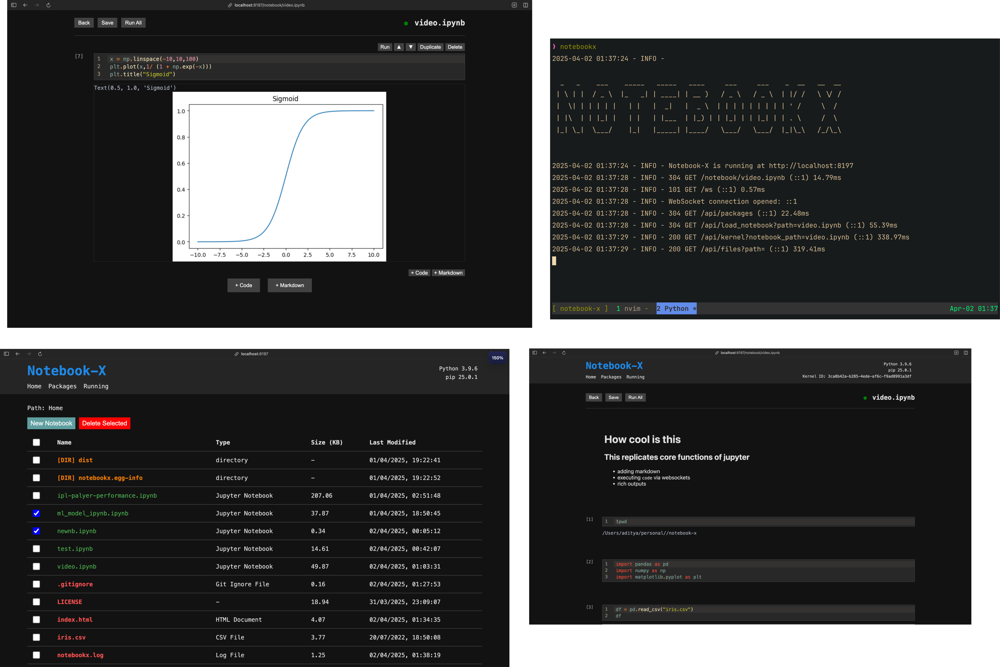

# Noteboox-X : Jupyter notebook clone

I’m building a custom Jupyter Notebook clone from scratch, designed to replicate core functionalities like viewing directory contents, reading and editing .ipynb files, running code cells, and selecting kernels.

```
make start
```


